# Chris Daw Walkthrough — Manual Platform Critique

**Date:** 2026-05-23
**Persona:** Chris Daw, RCIC — 20 years experience, Express Entry/IRB specialist
**Method:** Claude drove a headless browser as Chris, navigating the platform from scratch, screenshotting each step, and critiquing from Chris's perspective.

---

## 01 — Landing Page
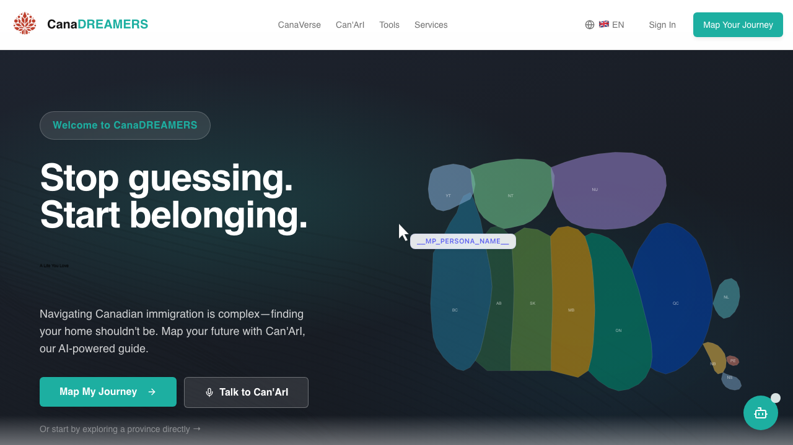

**What Chris sees:** "Stop guessing. Start belonging." — a hero section with the Canada map, "Map My Journey" and "Talk to Can'ArI" CTAs.

**Chris's reaction:** This is for immigrants, not for me. I'm an RCIC looking for a platform to list my practice. Where's the consultant entry point? No "For Consultants" CTA anywhere above the fold. I have to hunt for "Sign In" in the header.

---

## 02 — Full Page Scroll
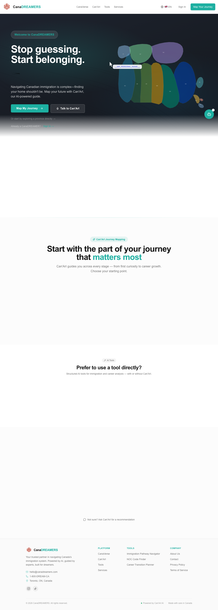

**What Chris sees:** The entire landing page — CanaVerse exploration, Can'ArI journey mapping, AI tools, and services. All immigrant-facing.

**Chris's reaction:** The whole page talks to newcomers. "Start with the part of your journey that matters most" — that's not my journey. I see "Services" in the nav but no "For Consultants" or "Join as a Professional" anywhere.

---

## 03 — Services Page
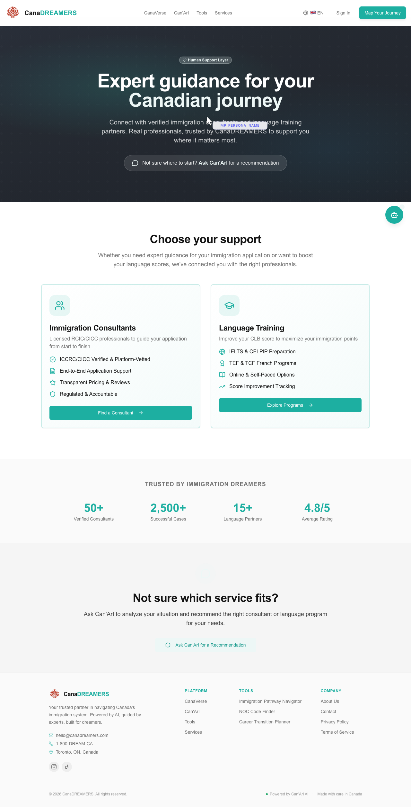

**What Chris sees:** "Expert guidance for your Canadian journey" — Immigration Consultants and Language Training sections. "ICCRC/CICC Verified & Platform-listed", "Find a Consultant" link.

**Chris's reaction:** This is the client-facing page — it tells immigrants to find consultants. Where's "Join as a Consultant"? Where do I register? I see "Find a Consultant" not "Become a Consultant."

---

## 04 — Consultant Directory
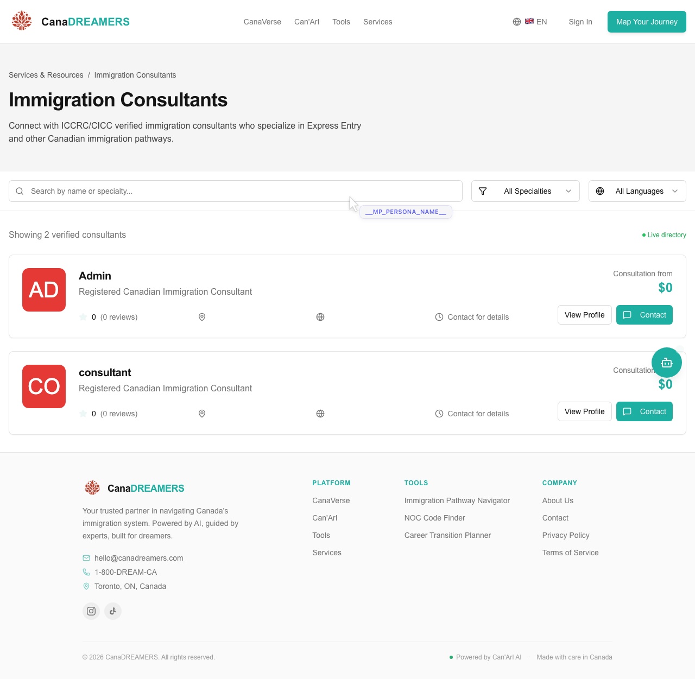

**What Chris sees:** "Showing 2 verified consultants" — "Admin" and "consultant" listed with $0 rates, no locations, no reviews. Search filters for name, specialties, languages.

**Chris's reaction:** This is bad. "Admin" and "consultant" are test accounts. $0 rates. No location. No reviews. If I'm evaluating this platform, I see fake profiles and it looks like a student project. No "Join as a Consultant" button anywhere on this page either.

---

## 05 — Consultant Login
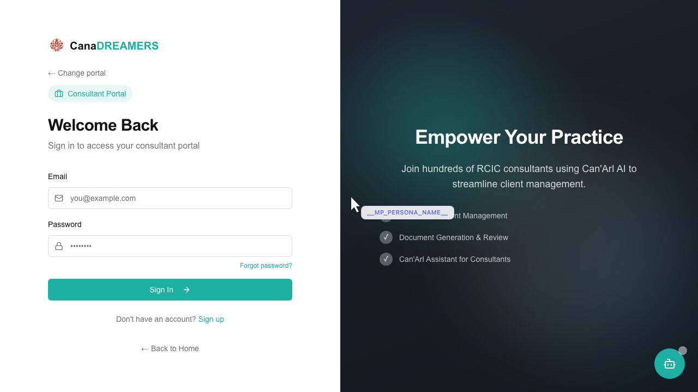

**What Chris sees:** Consultant Portal login — "Welcome Back", "Empower Your Practice", client management features listed on the right panel.

**Chris's reaction:** NOW we're talking. "Empower Your Practice — Join hundreds of RCIC consultants using Can'ArI AI." Client Management, Document Generation & Review, Can'ArI Assistant for Consultants. This feels professional. Clear "Sign up" link for new consultants.

---

## 06 — Onboarding Step 1
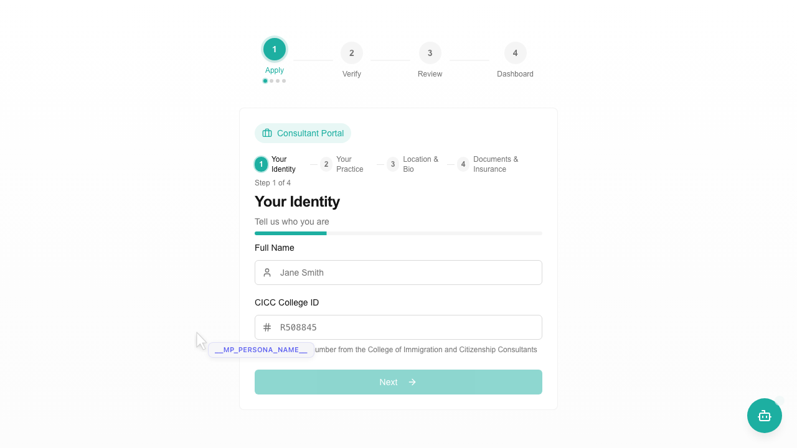

**What Chris sees:** Step 1 of 4 — "Your Identity". Full Name field (placeholder: Jane Smith), CICC College ID field (placeholder: R508845). Progress bar. Next button.

**Chris's reaction:** Clean form. Four steps visible at top (Apply → Verify → Review → Dashboard). Sub-steps inside (Identity → Practice → Location & Bio → Documents). The CICC College ID field is the right field — they know what to ask for. But no explanation of what happens with it.

---

## 07 — Onboarding Step 2
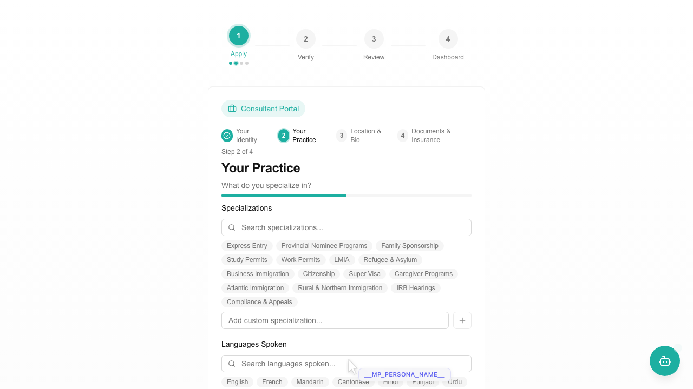

**What Chris sees:** "Your Practice" — specializations grid (Express Entry, Provincial Nominee Programs, Family Sponsorship, Study Permits, Work Permits, LMIA, Refugee & Asylum, Business Immigration, Citizenship, Super Visa, Caregiver Programs, Atlantic Immigration, Rural & Northern Immigration, IRB Hearings, Compliance & Appeals). Languages section below. Search and custom add available.

**Chris's reaction:** Comprehensive list. IRB Hearings included — they understand the distinction. "Add custom specialization" is a nice touch. Languages section covers the major Canadian languages.

---

## 08 — Onboarding Step 3
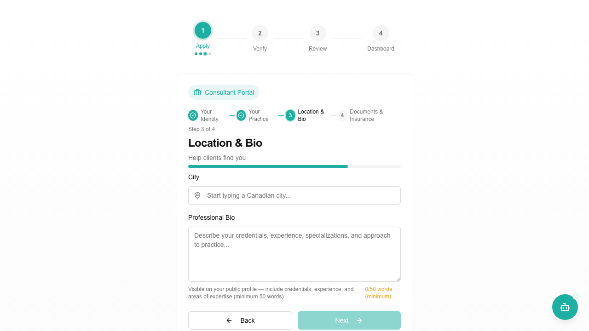

**What Chris sees:** "Location & Bio" — city field ("Start typing a Canadian city..."), Professional Bio textarea with 50-word minimum counter (0/50 words in red).

**Chris's reaction:** City is plain text — no autocomplete. I can type "Vancoouver" and nobody catches it. Bio has a clear minimum but no maximum. "Visible on your public profile" is good transparency.

---

## 09 — Onboarding Step 4 (Before UX Fixes)
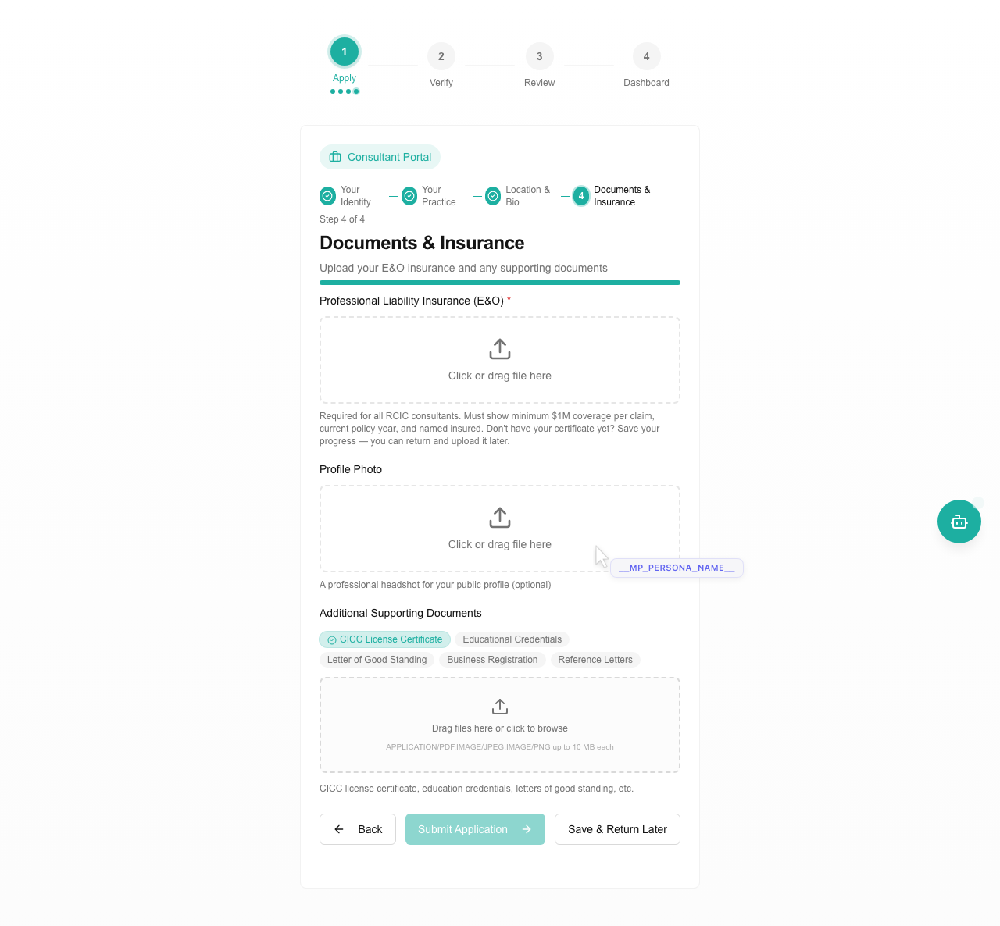

**What Chris sees:** "Documents & Insurance" — E&O upload (required), Profile Photo (optional), Additional Supporting Documents (CICC License Certificate, Educational Credentials, Letter of Good Standing, Business Registration, Reference Letters). Submit Application button, Save & Return Later button.

**Chris's reaction:** E&O required with $1M coverage explanation — they know the ENCON requirements. Good. "Save & Return Later" is important. But Submit is disabled and I don't know why.

---

## 10 — After Login Redirect Fix
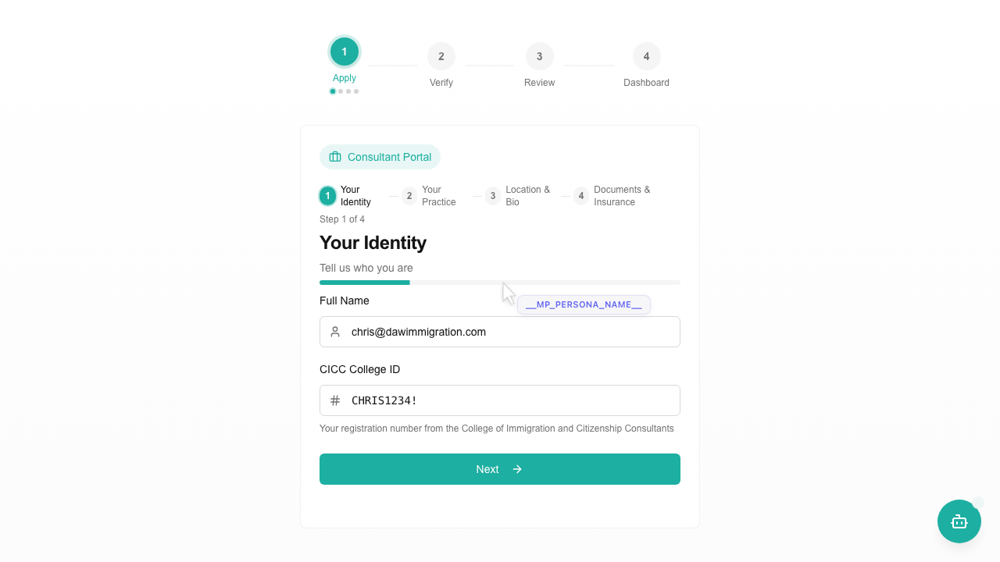

**What Chris sees:** Same onboarding form — but now Chris arrived here directly from login without seeing the immigrant dashboard first.

**Chris's reaction:** No dashboard flash. Straight to the consultant portal. That's how it should be.

---

## 11 — Documents with UX Fixes
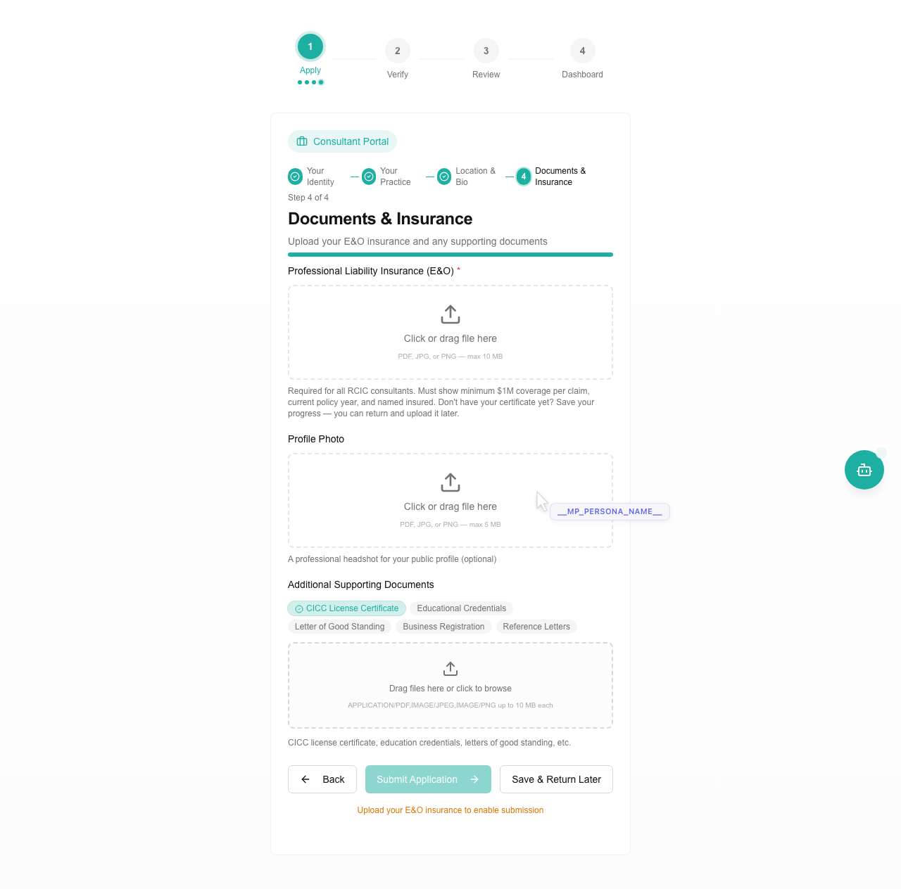

**What Chris sees:** E&O upload now shows "PDF, JPG, or PNG — max 10 MB" under the drop zone. Profile Photo shows "PDF, JPG, or PNG — max 5 MB". At the bottom: "Upload your E&O insurance to enable submission" in amber text explaining why Submit is disabled.

**Chris's reaction:** Now I know what formats are accepted and why I can't submit. The amber helper text is clear. Profile Photo accepting PDF is wrong for a headshot though — should be JPG/PNG only.

---

## 12 — After E&O Upload
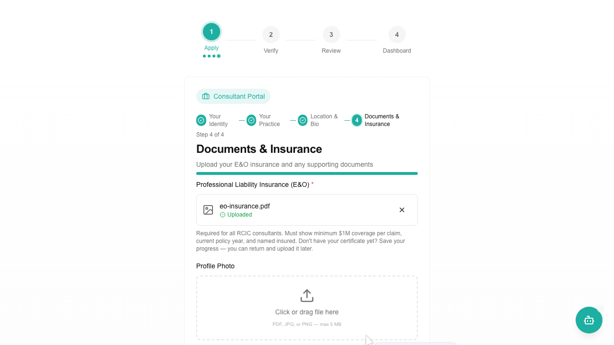

**What Chris sees:** "eo-insurance.pdf — ✓ Uploaded" with an X to remove. The file is confirmed. Submit should now be enabled.

**Chris's reaction:** Clean upload confirmation. Filename shows, status is green. Good.

---

## 13 — Verification Page
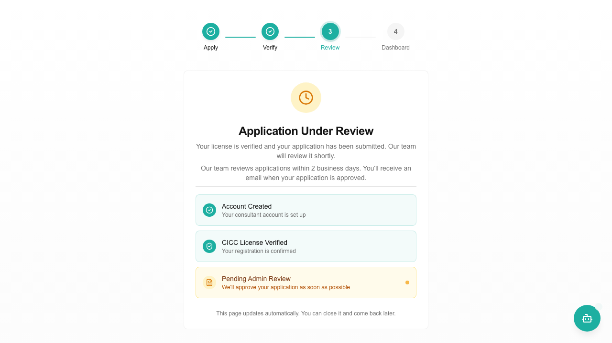

**What Chris sees:** "Verify Your CICC License" — College ID R409583 displayed. "Checking CICC Register..." error shown (from the earlier Xvfb crash). Skip Verification option available.

**Chris's reaction:** This was before the headless fix. The verification failed because the browser couldn't start. In the working version, this page shows the spinner for ~10 seconds, then displays: Christopher Robert Daw — Daw Immigration Solutions Inc — RCIC-IRB - L3 — Entitled to Practice: Yes.

---

## Summary of Critiques

### What works well
- Consultant Portal login page — professional messaging
- CICC College ID field — right format, right field
- Specialization list — comprehensive, includes IRB
- E&O requirement — knows ENCON standards
- Verification result card — full data from live register
- Pending review page — checklist, timeline, email promise

### What needs work
1. No "For Consultants" CTA on landing page
2. Test accounts in directory ($0 rates, generic names) — fixed
3. City field has no autocomplete
4. Bio has no max length
5. Submit disabled with no explanation — fixed
6. E&O upload didn't show formats — fixed
7. Profile Photo accepts PDF (should be images only)
8. Verification spinner had no context — fixed
9. Post-verification auto-advance too fast — fixed (6s + Continue button)

### Fixes Applied During Session
- Login redirect: store role on login, skip role selector via `?role=consultant`
- Submit helper text: "Upload your E&O insurance to enable submission"
- Verification spinner context: "this usually takes about 10 seconds"
- Test accounts filtered from directory
- Pending review: "2 business days" timeline
- E&O upload format indicator
- Verification result display: 6s + Continue button
- Response decryption: `decryptResponse()` added to all onboarding components
